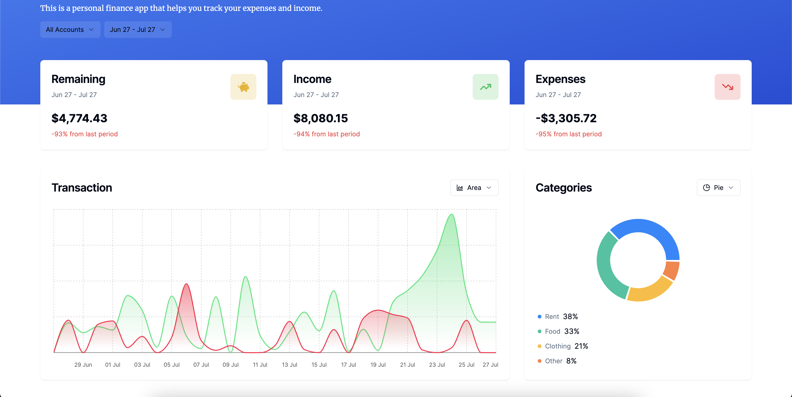
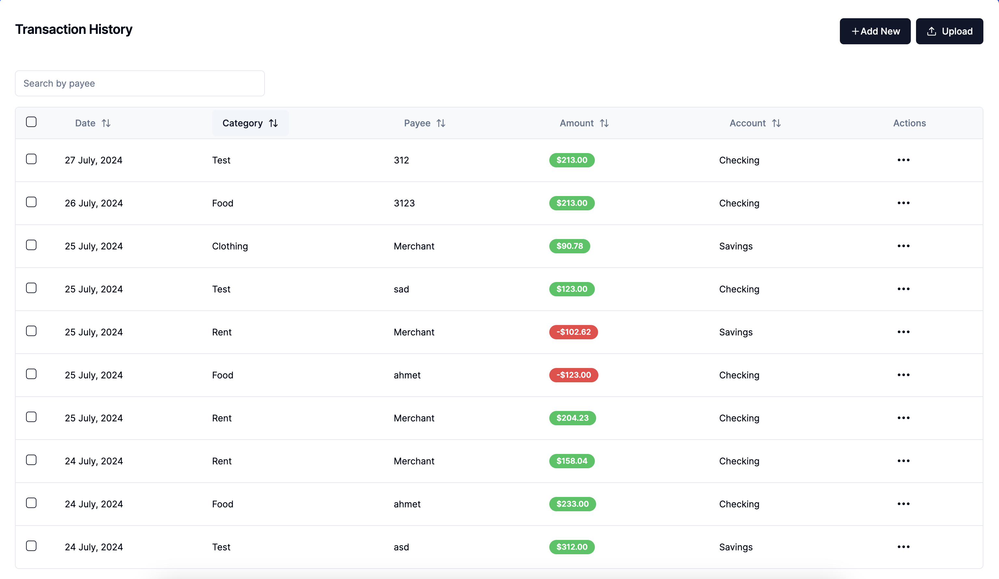
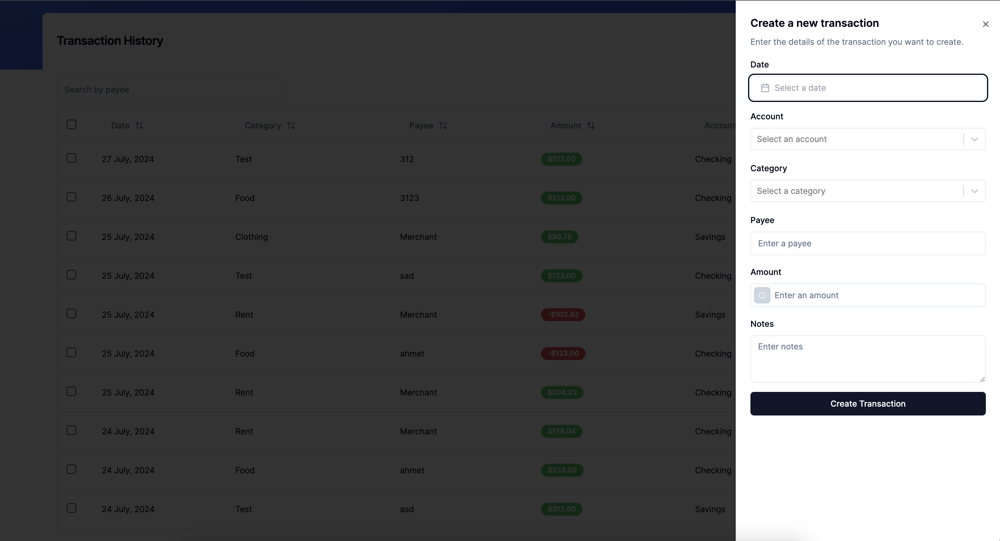
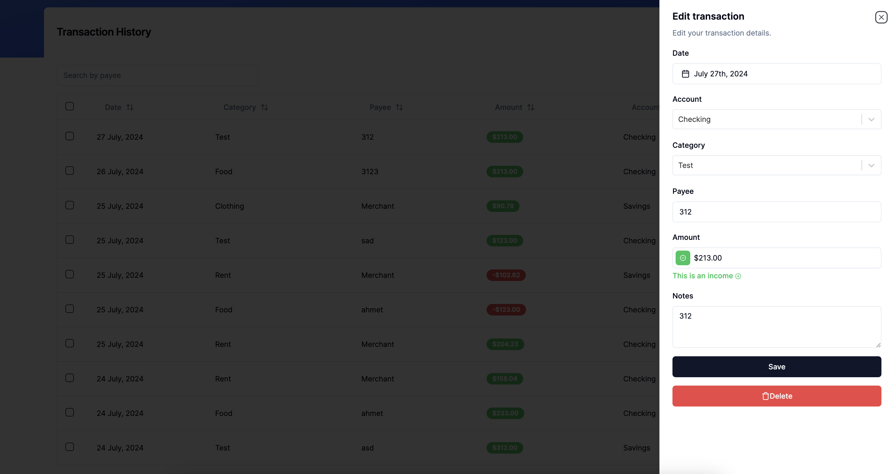
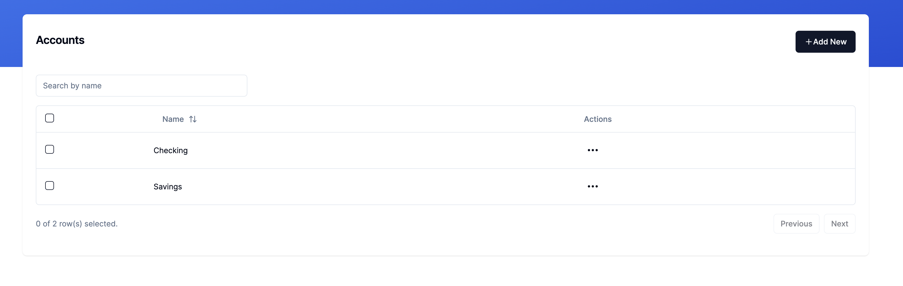

# Finance App

Finance App, kişisel finansmanınızı takip etmenizi sağlayan bir web uygulamasıdır. Bu proje, kullanıcıların gelir ve giderlerini izlemelerine yardımcı olur. Uygulama, kullanıcı dostu bir arayüze sahiptir ve çeşitli özellikler sunar.

## Proje Özellikleri

- **İşlem Görüntüleme**: Tüm işlemlerinizin listesini görüntüleyin.
- **İşlem Filtreleme**: Hesap ve tarih aralığına göre işlemleri filtreleyin.
- **Hesap Ekleme/Düzenleme/Silme**: Hesaplarınızı kolayca yönetin.
- **Kategori Ekleme/Düzenleme/Silme**: İşlemlerinizi kategorilere ayırarak organize edin.
- **Yeni İşlem Ekleme**: Tarih, hesap, kategori, alıcı, tutar ve notlar gibi detaylarla kolayca yeni işlemler ekleyin.

## Kullanılan Teknolojiler

- **Framework**: Next.js
- **Stil**: Tailwind CSS
- **Durum Yönetimi**: Zustand
- **Form Yönetimi**: React Hook Form
- **Grafikler**: Recharts
- **Veritabanı**: Drizzle ORM ile PostgreSQL
- **Kimlik Doğrulama**: Clerk
- **Diğer Kütüphaneler**:
  - Radix UI bileşenleri
  - TanStack React Query veri getirme
  - Date-fns tarih manipülasyonu

## Kurulum ve Çalıştırma

Projeyi yerel ortamınızda çalıştırmak için aşağıdaki adımları izleyin:

### Gerekli Bağımlılıkların Yüklenmesi

Öncelikle gerekli bağımlılıkları yüklemek için:

```bash
npm install
```

### Geliştirme Sunucusunu Başlatma

Uygulamayı yerel ortamda çalıştırmak için:

```bash
npm run dev
```

Bu komut, uygulamanın geliştirme sunucusunu başlatacak ve tarayıcınızda http://localhost:3000 adresinde açacaktır.

### Üretim İçin Derleme

Uygulamayı üretim için derlemek için:

```bash
npm run build
```

## Komutlar

- **dev**: Geliştirme sunucusunu başlatır.
- **build**: Uygulamayı üretim için derler.
- **start**: Uygulamayı üretim modunda başlatır.
- **lint**: ESLint ile kodu kontrol eder.
- **db:generate**: Veritabanı şemasını oluşturur.
- **db:migrate**: Veritabanı göçlerini çalıştırır.
- **db:seed**: Özel veritabanı scriptlerini çalıştırır.
- **db:studio**: Drizzle ORM stüdyosunu açar.

### Canlı Demo

Uygulamanın canlı demosunu buradan inceleyebilirsiniz.

## Ekran Görüntüleri

### Dashboard



### Transactions





### Accounts



## Canlı Demo

Uygulamanın canlı demosunu [buradan](https://finance-jade.vercel.app/sign-in?redirect_url=https%3A%2F%2Ffinance-jade.vercel.app%2F) inceleyebilirsiniz.

## Lisans

Bu proje MIT Lisansı ile lisanslanmıştır. Detaylar için [LICENSE dosyasına](LICENSE) bakın.
